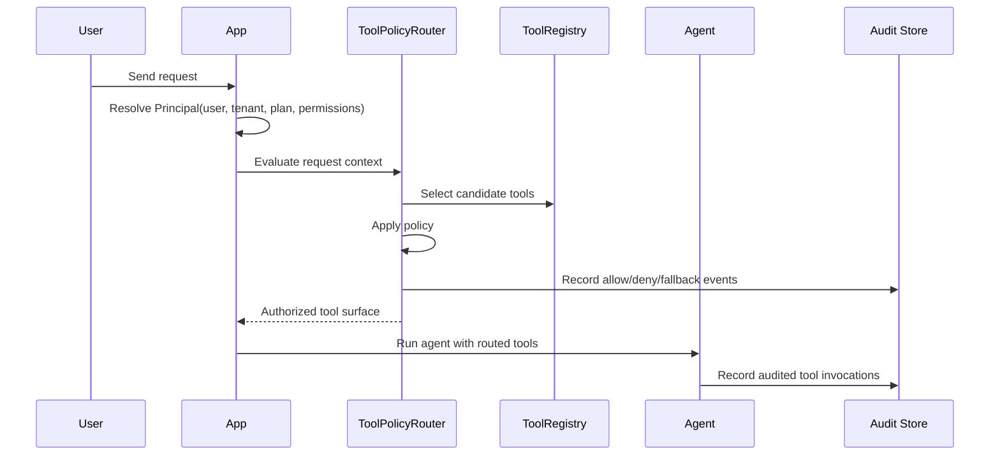

# Runtime Tool Authorization for AI Agents

```text
━━━━━━━━━━━━━━━━━━━━━━━━━━━━━━━━━━━━━━━━━━━━━━━━━━━━━━━━━━━━━━━━━━━━━━
Runtime Tool Authorization
for AI Agents
━━━━━━━━━━━━━━━━━━━━━━━━━━━━━━━━━━━━━━━━━━━━━━━━━━━━━━━━━━━━━━━━━━━━━━
Never expose every tool.
Expose the right tool.
━━━━━━━━━━━━━━━━━━━━━━━━━━━━━━━━━━━━━━━━━━━━━━━━━━━━━━━━━━━━━━━━━━━━━━
```

Dynamic Tool Router is a runtime governance layer for LangChain and LangGraph agents. It decides which tools an agent may see, inject, invoke, deny, and audit per user, tenant, plan, role, permission, request context, and available MCP-style tool surface.

This repository is a **developer preview** for teams building multi-tenant AI products. It proves the product pattern locally before a hosted policy service, authenticated dashboard, enterprise audit backend, or production IAM integration exists.

## The Missing Layer

```text
LLMs
  ↓
Agents
  ↓
Runtime Tool Authorization   ← this project
  ↓
Tools
  ↓
Your Infrastructure
```

Most agent frameworks make tool access feel static: define tools, create the agent, run the agent. That works for demos.

It breaks down in multi-tenant products:

- different tenants buy different plans,
- different users have different roles,
- different requests expose different MCP servers,
- tools may be unsafe outside a specific context,
- security reviewers need evidence of allow/deny/fallback behavior.

The product question is not only:

```text
Which tools are relevant?
```

It is also:

```text
Which tools is this user, tenant, plan, role, and request allowed to use right now?
```

## What It Does

- Evaluates tool policy at request time.
- Injects only authorized tools into an agent/tool surface.
- Routes denied tools to a fallback tool.
- Supports per-user, per-tenant, plan, role, permission, context, and MCP-server policy dimensions.
- Loads JSON policy configuration from disk.
- Persists audit events to JSONL.
- Exports audit events to JSON.
- Provides LangChain-style and LangGraph-style adapter shapes.
- Includes dependency-gated real-framework integration tests.
- Includes a static admin dashboard example for visibility.

## Killer Contrast

```text
WITHOUT

Agent
 ├── SQL
 ├── CRM
 ├── GitHub
 ├── Stripe
 ├── AWS
 ├── Slack
 ├── Jira
 └── ...

Every tool is potentially visible unless the app manually filters it.
```

```text
WITH

Tenant A
Agent
 ├── SQL     ✓
 └── CRM     ✓

Tenant B
Agent
 ├── GitHub  ✓
 └── Slack   ✓

Tenant C
Agent
 └── AWS     ✓

Each request receives only the tool surface it is allowed to use.
```

## Architecture

```text
                AI Product
                     │
                     ▼
         Authentication Layer
                     │
                     ▼
        Principal Resolution
                     │
                     ▼
 user • tenant • plan • roles • permissions • MCP servers
                     │
                     ▼
╔══════════════════════════════════════════════════════════════════════╗
║                    Runtime Tool Authorization                       ║
║──────────────────────────────────────────────────────────────────────║
║  ✓ Policy evaluation                                                ║
║  ✓ Runtime tool injection                                           ║
║  ✓ RBAC-style gating                                                ║
║  ✓ MCP tool surface filtering                                       ║
║  ✓ Fallback routing                                                 ║
║  ✓ Audit persistence                                                ║
╚══════════════════════════════════════════════════════════════════════╝
                     │
                     ▼
            Authorized Tool Surface
                     │
       ┌─────────────┼─────────────┐
       ▼             ▼             ▼
  Search Tool    CRM Tool      SQL Tool
```

## Request Lifecycle



## Install For Local Development

```sh
python -m pip install -e .
```

The core package has no required LangChain or LangGraph runtime dependency. Integration tests are dependency-gated so the router can stay lightweight.

## Quickstart

Run the local demo:

```sh
python examples/basic_agent/run_example.py
```

The demo shows:

- JSON policy loading,
- runtime tool injection,
- authorized tool exposure,
- denied tool fallback,
- LangGraph-style state middleware,
- JSONL audit persistence,
- JSON audit export.

Expected shape:

```text
Injected tools: search_docs, fetch_customer_record, not_authorized
LangGraph state tools: search_docs, not_authorized
Audit export: /tmp/.../runtime_audit_export.json
```

## Policy Example

```json
{
  "version": 1,
  "fallback_tool_name": "not_authorized",
  "policies": {
    "search_docs": {
      "allowed_plans": ["free", "pro", "enterprise"]
    },
    "fetch_customer_record": {
      "allowed_plans": ["pro", "enterprise"],
      "required_permissions": ["records:read"]
    },
    "delete_customer_record": {
      "allowed_plans": ["enterprise"],
      "required_permissions": ["records:delete"]
    }
  }
}
```

See `docs/policy-format.md` for the full developer-preview policy format.

## Audit Example

```json
{
  "event_type": "deny",
  "tool_name": "delete_customer_record",
  "user_id": "user_123",
  "tenant_id": "tenant_acme",
  "reason": "missing required permission: records:delete"
}
```

Audit events are persisted locally as JSON Lines and can be exported to JSON. See `docs/audit-log-format.md`.

## LangChain And LangGraph Compatibility

The core package works with:

- objects with a `name` attribute and `invoke()` method,
- plain callables wrapped in `CallableTool`,
- LangChain-like agent config dictionaries using `RuntimeToolInjector.inject_into_agent_kwargs()`,
- LangGraph-like state dictionaries using `LangGraphToolRouterMiddleware.before_model()`.

Optional real-framework integration tests exist under `tests/integration`. If LangChain/LangGraph packages are not installed, the tests skip with explicit dependency messages.

```sh
PYTHONPATH=src python -m unittest discover -s tests/integration
```

See `docs/langchain-langgraph-integration.md`.

## Documentation

- `docs/product-positioning.md` — buyer narrative and wedge use cases.
- `docs/demo-guide.md` — local evaluation flow.
- `docs/policy-format.md` — JSON policy format.
- `docs/audit-log-format.md` — persisted audit event format.
- `docs/security-model.md` — security boundaries and non-goals.
- `docs/persistent-policy-and-audit-store.md` — file-backed store notes.
- `docs/langchain-langgraph-integration.md` — optional framework integration behavior.
- `docs/release-notes.md` — developer-preview release notes.

## Security Model Summary

Dynamic Tool Router is an authorization and routing layer for tool visibility. It is not a sandbox, secret manager, IAM provider, compliance product, or tamper-proof audit system.

Developer-preview limitations:

- local audit files can be modified by anyone with filesystem access,
- JSON policy validation catches common configuration errors but is not formal verification,
- static admin dashboard is unauthenticated,
- fallback behavior reduces unsafe exposure but does not secure the tool implementation itself,
- no hosted policy API or production auth-provider integration is included.

See `docs/security-model.md`.

## Verification

Core verification:

```sh
python -m json.tool feature_list.json
PYTHONPATH=src python -m unittest discover -s tests
python examples/basic_agent/run_example.py
```

Optional integration verification:

```sh
PYTHONPATH=src python -m unittest discover -s tests/integration
```

If optional framework dependencies are absent, integration tests should skip explicitly rather than failing core verification.

## Roadmap

```text
SHIP-001  Developer Preview Release                  active

001       Dynamic Tool Router MVP                    done
002       Persistent policy and audit store          done
003       Real LangChain/LangGraph integration       done
004       Sellable developer preview                 in progress
005       README 3.0 landing page                    candidate
006       Architecture & Mermaid diagrams            candidate
007       Demo experience                            candidate
008       GitHub trust signals                       candidate
009       Packaging & release                        candidate
010       Security whitepaper                        candidate
```

## Harness SDLC Evidence

This repository follows a harness-style SDLC:

```text
[SPEC] -> [APPROVAL] -> [IMPLEMENT] -> [VERIFY] -> [REVIEW] -> [CLOSE]
```

Feature artifacts live under:

```text
feature_list.json
specs/
adr/
docs/
progress/
epics/
tests/
examples/
```

Developer preview status: SHIP-mode hardening is underway. Do not treat the package as production IAM or compliance infrastructure yet.
