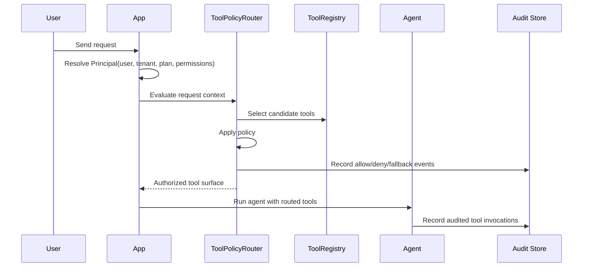

# Runtime Tool Authorization for AI Agents

```text
━━━━━━━━━━━━━━━━━━━━━━━━━━━━━━━━━━━━━━━━━━━━━━━━━━━━━━━━━━━━━━━━━━━━━━
Runtime Tool Authorization
for AI Agents
━━━━━━━━━━━━━━━━━━━━━━━━━━━━━━━━━━━━━━━━━━━━━━━━━━━━━━━━━━━━━━━━━━━━━━
Never expose every tool.
Expose the right tool.
━━━━━━━━━━━━━━━━━━━━━━━━━━━━━━━━━━━━━━━━━━━━━━━━━━━━━━━━━━━━━━━━━━━━━━
```

Dynamic Tool Router is a request-time authorization layer for LangChain and LangGraph agents. It decides which tools an agent may see, inject, invoke, deny, and audit per user, tenant, plan, role, permission, request context, and available MCP-style tool surface.

> Developer preview: local policy files, local audit evidence, framework adapter shapes, dependency-gated LangChain/LangGraph integration tests, and mock-safe billing entitlement contracts. Not a hosted IAM product, billing service, or compliance product yet.

## Why This Exists

Everyone is building AI agents. Fewer teams are building the infrastructure that controls which tools those agents are allowed to use.

Most agent frameworks make tool access feel static: define tools, create the agent, run the agent. That works for demos. It breaks down in multi-tenant products where users, tenants, plans, roles, and available MCP servers change per request.

```text
The old question:
Which tools are relevant?

The product question:
Which tools is this user, tenant, plan, role, and request allowed to use right now?
```

## The Missing Layer

```text
LLMs
  ↓
Agents
  ↓
Runtime Tool Authorization   ← this project
  ↓
Tools
  ↓
Your Infrastructure
```

## What It Gives You

| Capability | Developer-preview behavior |
|---|---|
| Runtime authorization | Evaluates tool policy per request context. |
| Tool injection | Exposes only the authorized tool surface. |
| Fallback routing | Maps unavailable tools to a safe fallback tool. |
| Multi-tenant policy | Supports user, tenant, plan, role, permission, context, and MCP-server dimensions. |
| Policy persistence | Loads JSON policy configuration from disk. |
| Audit evidence | Persists JSONL audit events and exports JSON. |
| LangChain/LangGraph compatibility | Provides adapter shapes and dependency-gated real-framework tests. |
| Billing entitlement contracts | Includes mock-safe Checkout, entitlement, license activation, webhook idempotency, and premium gating contracts. Provider abstraction is being specified so Stripe remains optional. |
| Dashboard visibility | Includes static dashboard documentation and sample-data direction. |

## Killer Contrast

```text
WITHOUT

Agent
 ├── SQL
 ├── CRM
 ├── GitHub
 ├── Stripe
 ├── AWS
 ├── Slack
 ├── Jira
 └── ...

Every tool is potentially visible unless the app manually filters it.
```

```text
WITH

Tenant A
Agent
 ├── SQL     ✓
 └── CRM     ✓

Tenant B
Agent
 ├── GitHub  ✓
 └── Slack   ✓

Tenant C
Agent
 └── AWS     ✓

Each request receives only the tool surface it is allowed to use.
```

## Architecture

```text
                AI Product
                     │
                     ▼
         Authentication Layer
                     │
                     ▼
        Principal Resolution
                     │
                     ▼
 user • tenant • plan • roles • permissions • MCP servers
                     │
                     ▼
╔══════════════════════════════════════════════════════════════════════╗
║                    Runtime Tool Authorization                       ║
║──────────────────────────────────────────────────────────────────────║
║  ✓ Policy evaluation                                                ║
║  ✓ Runtime tool injection                                           ║
║  ✓ RBAC-style gating                                                ║
║  ✓ MCP tool surface filtering                                       ║
║  ✓ Fallback routing                                                 ║
║  ✓ Audit persistence                                                ║
╚══════════════════════════════════════════════════════════════════════╝
                     │
                     ▼
            Authorized Tool Surface
                     │
       ┌─────────────┼─────────────┐
       ▼             ▼             ▼
  Search Tool    CRM Tool      SQL Tool
```

## Request Lifecycle



## Install

```sh
python -m pip install -e .
```

The core package has no required LangChain, LangGraph, Stripe, or billing-provider runtime dependency. Integration and billing contracts are dependency-light so the router can stay lightweight.

## Run The Demo

```sh
python examples/basic_agent/run_example.py
```

Expected output shape:

```text
Injected tools: search_docs, fetch_customer_record, not_authorized
search_docs: [{'title': 'Plan limits', 'snippet': 'Search result for retention policy'}]
LangGraph state tools: search_docs, not_authorized
Audit export: /tmp/.../runtime_audit_export.json
```

The demo proves:

- JSON policy loading,
- runtime tool injection,
- authorized tool exposure,
- unavailable tool fallback,
- LangGraph-style state middleware,
- JSONL audit persistence,
- JSON audit export.

## Policy Example

```json
{
  "version": 1,
  "fallback_tool_name": "not_authorized",
  "policies": {
    "search_docs": {
      "allowed_plans": ["free", "pro", "enterprise"]
    },
    "fetch_customer_record": {
      "allowed_plans": ["pro", "enterprise"],
      "required_permissions": ["records:read"]
    },
    "delete_customer_record": {
      "allowed_plans": ["enterprise"],
      "required_permissions": ["records:delete"]
    }
  }
}
```

See `docs/policy-format.md` for the full developer-preview policy format.

## Audit Example

```json
{
  "action": "authorize",
  "allowed": false,
  "tool_name": "delete_customer_record",
  "user_id": "user_123",
  "tenant_id": "tenant_acme",
  "reason": "plan is not allowed",
  "metadata": {
    "fallback_tool_name": "not_authorized"
  }
}
```

Audit events are persisted locally as JSON Lines and can be exported to JSON. See `docs/audit-log-format.md`.

## LangChain And LangGraph Compatibility

The core package works with:

- objects with a `name` attribute and `invoke()` method,
- plain callables wrapped in `CallableTool`,
- LangChain-like agent config dictionaries using `RuntimeToolInjector.inject_into_agent_kwargs()`,
- LangGraph-like state dictionaries using `LangGraphToolRouterMiddleware.before_model()`.

Optional real-framework integration tests exist under `tests/integration`. If LangChain/LangGraph packages are not installed, the tests skip with explicit dependency messages.

```sh
PYTHONPATH=src python -m unittest discover -s tests/integration
```

See `docs/langchain-langgraph-integration.md`.

## Who This Is For

| Reader | Why they care |
|---|---|
| CTO | Shows disciplined AI infrastructure, product judgment, and security restraint. |
| AI platform engineer | Provides a reusable policy layer for agent tool surfaces. |
| SaaS product team | Enables plan, tenant, role, and permission-aware agent behavior. |
| Security reviewer | Produces explicit allow, deny, fallback, and invoke evidence. |
| Design partner | Offers a concrete starting point for agent-tool governance pilots. |

## Documentation

- `docs/product-positioning.md` — buyer narrative and wedge use cases.
- `docs/design-partner-kit.md` — design partner qualification, discovery, pilot scoping, demo flow, and feedback collection.
- `docs/pricing.md` — pricing, trial, design partner offer, and monetization architecture.
- `docs/stripe-entitlement-billing.md` — Stripe Checkout, entitlement, license validation, and premium gating contracts; Stripe should be treated as an optional adapter path.
- `docs/architecture.md` — architecture, request lifecycle, policy flow, and adapter boundaries.
- `docs/demo-guide.md` — local evaluation flow.
- `docs/policy-format.md` — JSON policy format.
- `docs/audit-log-format.md` — persisted audit event format.
- `docs/security-model.md` — security boundaries and non-goals.
- `docs/security-whitepaper.md` — security posture, threat assumptions, non-goals, and reviewer checklist.
- `docs/admin-dashboard.md` — dashboard purpose and limitations.
- `docs/persistent-policy-and-audit-store.md` — file-backed store notes.
- `docs/langchain-langgraph-integration.md` — optional framework integration behavior.
- `docs/release-notes.md` — developer-preview release notes.
- `docs/release-checklist.md` — release verification and tagging checklist.
- `docs/v0.1.0-dev-release-notes.md` — first developer-preview release notes.

## Packaging & Release

Package metadata is defined in `pyproject.toml`.

Current developer-preview package version:

```text
0.1.0.dev0
```

Editable install:

```sh
python -m pip install -e .
```

One-command local release-candidate verification:

```sh
python scripts/verify_release_candidate.py
```

Build, if the `build` module is available:

```sh
python -m pip install -e .[dev]
python -m build
```

This repository currently prepares packaging and release documentation only. It does not publish to PyPI, create a GitHub Release, or create a git tag.

## Trust & Project Governance

- `SECURITY.md` — security policy, reporting path, and developer-preview security boundary.
- `CONTRIBUTING.md` — local setup, verification, and harness workflow.
- `CHANGELOG.md` — developer-preview release history.
- `CODE_OF_CONDUCT.md` — collaboration expectations.
- `LICENSE` — MIT license.
- `feature_list.json`, `specs/`, `progress/`, and `adr/` — harness SDLC evidence.

## Security Boundary

Dynamic Tool Router is an authorization and routing layer for tool visibility. It is not a sandbox, credential vault, IAM provider, compliance product, billing processor, hosted IAM product, or tamper-proof audit system.

Developer-preview limitations:

- local audit files can be modified by anyone with filesystem access,
- JSON policy validation catches common configuration errors but is not formal verification,
- static admin dashboard is unauthenticated,
- billing entitlement contracts are mock-safe and do not run live charges,
- provider abstraction is spec-ready and not implemented yet,
- fallback behavior reduces unsafe exposure but does not secure the tool implementation itself,
- no hosted policy API or production auth-provider integration is included.

See `docs/security-model.md`.

## Verification

Core verification:

```sh
python -m json.tool feature_list.json
PYTHONPATH=src python -m unittest discover -s tests
python examples/basic_agent/run_example.py
python examples/demo_experience/run_demo.py
```

Optional integration verification:

```sh
PYTHONPATH=src python -m unittest discover -s tests/integration
```

If optional framework dependencies are absent, integration tests should skip explicitly rather than failing core verification.

Release-candidate verification:

```sh
python scripts/verify_release_candidate.py
```

## Roadmap

```text
SHIP-001  Developer Preview Release                  active

001       Dynamic Tool Router MVP                    done
002       Persistent policy and audit store          done
003       Real LangChain/LangGraph integration       done
004       Sellable developer preview                 done
005       README 3.0 landing page                    done
006       GitHub trust signals                       done
007       Architecture & Mermaid diagrams            done
008       Demo experience                            done
009       Packaging & release                        done
010       Release candidate polish                   done
011       Security whitepaper                        done
012       Design partner kit                         done
013       Pricing and landing copy                   done
014       Stripe entitlement billing                 done
015       Billing provider abstraction               spec_ready
```

## Design Partner Signal

This project is ready for design-partner conversations around:

- agent tool authorization,
- multi-tenant agent governance,
- LangChain/LangGraph tool routing,
- MCP-style tool surface filtering,
- audit evidence for agent actions,
- productizing internal agent infrastructure.

See `docs/design-partner-kit.md` for qualification, discovery, pilot scoping, demo flow, and feedback collection.

## Pricing

Start free for 30 days. Then `$9/month` for solo builders or `$19/user/month` for teams.

We are accepting 20 design partners to shape the runtime authorization layer for AI agents. Founding design partners get a `$49/month` flat plan for up to 5 users, locked for 12 months.

Access should be enforced through a provider-agnostic entitlement layer, not through marketplace install gating. Stripe is an optional adapter path, not the only billing path. See `docs/pricing.md` and `docs/stripe-entitlement-billing.md`.

## Harness SDLC Evidence

This repository follows a harness-style SDLC:

```text
[SPEC] -> [APPROVAL] -> [IMPLEMENT] -> [VERIFY] -> [REVIEW] -> [CLOSE]
```

Feature artifacts live under:

```text
feature_list.json
specs/
adr/
docs/
progress/
epics/
tests/
examples/
```

Developer preview status: Feature 014 is closed. Feature 015 is open as a spec gate to make the billing layer provider-agnostic. Do not treat the package as production IAM, production billing, or compliance infrastructure yet.
