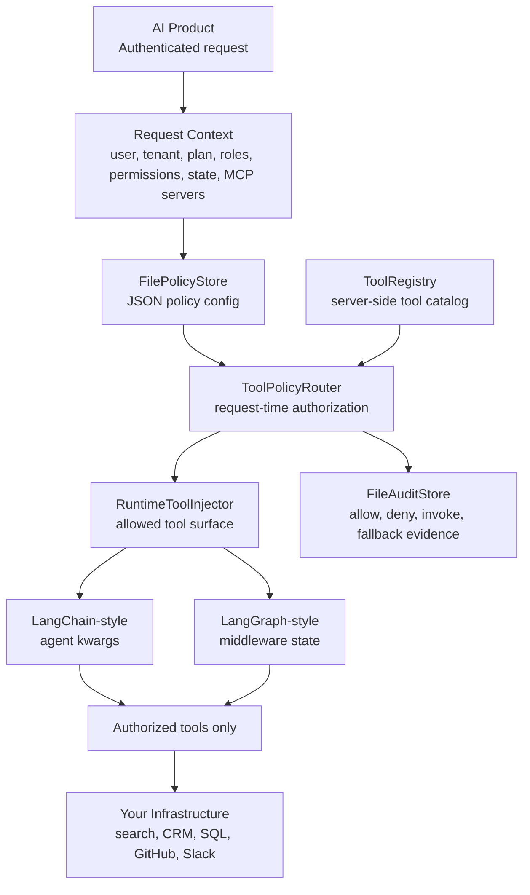
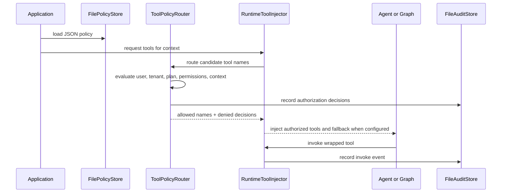
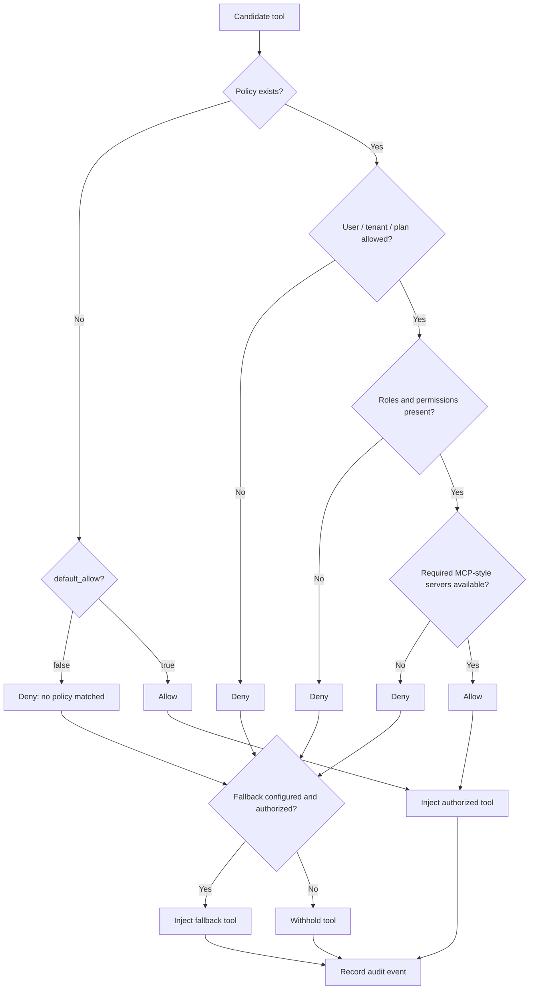
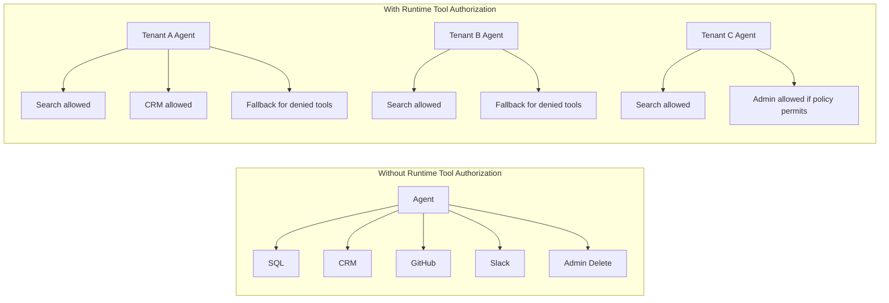
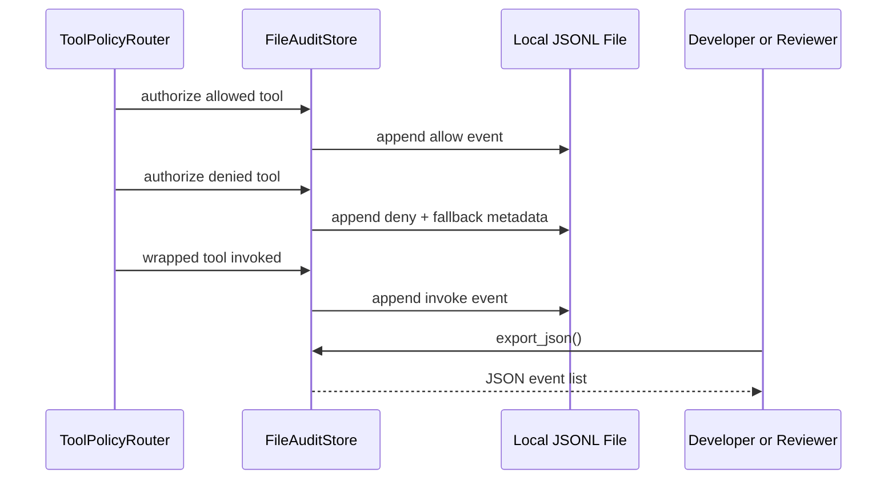
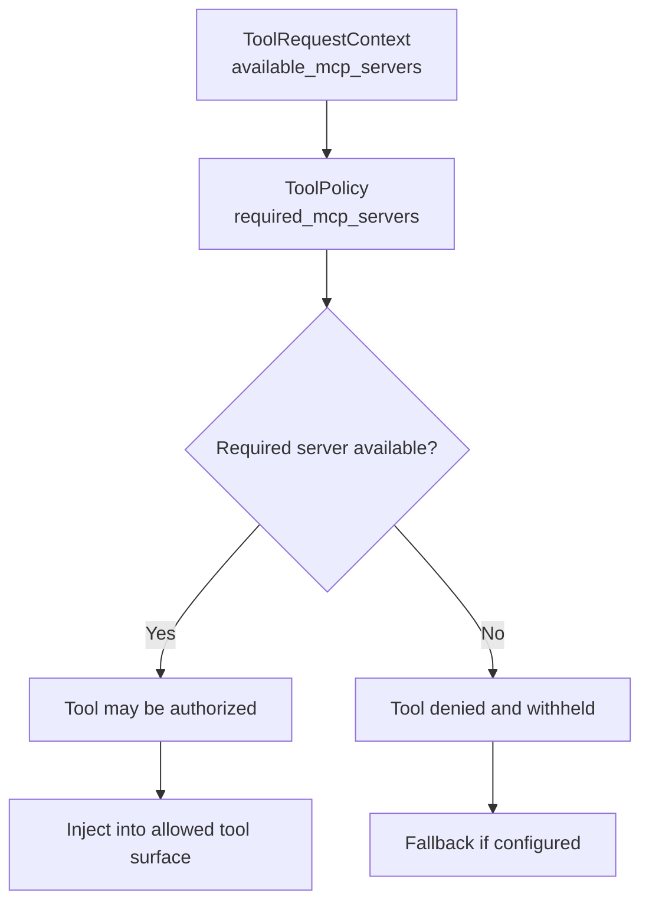

# Architecture

```text
Runtime Tool Authorization
for AI Agents

Never expose every tool.
Expose the right tool.
```

Runtime Tool Authorization is the missing authorization layer between:

```text
LLMs -> Agents -> Tools -> Your Infrastructure
```

It is a developer-preview library for request-time tool authorization. It evaluates the current user, tenant, plan, permissions, request context, policy configuration, and available MCP-style tool surface before an agent receives tools.

It is not a hosted IAM product, compliance product, sandbox, secret manager, or production security boundary.

## System Architecture

Terminal-native view:

```text
┌─────────────────────────────────────────────────────────────────────┐
│                           AI Product                                │
│                                                                     │
│  Authenticated request                                              │
│  user + tenant + plan + roles + permissions + context               │
└───────────────────────────────┬─────────────────────────────────────┘
                                │
                                ▼
┌─────────────────────────────────────────────────────────────────────┐
│                 Runtime Tool Authorization Layer                    │
│                                                                     │
│  FilePolicyStore -> ToolPolicyRouter -> RuntimeToolInjector         │
│                         │                                           │
│                         ├─ allow -> authorized tool surface          │
│                         ├─ deny  -> withheld tool                    │
│                         └─ fallback -> safe not_authorized tool      │
│                                                                     │
│  FileAuditStore records allow, deny, invoke, and fallback evidence   │
└───────────────────────────────┬─────────────────────────────────────┘
                                │
                                ▼
┌─────────────────────────────────────────────────────────────────────┐
│                     LangChain / LangGraph Boundary                  │
│                                                                     │
│  LangChain-style agent kwargs     LangGraph-style state middleware  │
└───────────────────────────────┬─────────────────────────────────────┘
                                │
                                ▼
┌─────────────────────────────────────────────────────────────────────┐
│                         Tool Infrastructure                         │
│                                                                     │
│  Search Tool   CRM Tool   SQL Tool   GitHub Tool   Slack Tool       │
│      ▲            ▲          ▲            ▲            ▲            │
│      └────────────┴──────────┴────────────┴────────────┘            │
│             MCP-style available tool/server surface                 │
└─────────────────────────────────────────────────────────────────────┘
```

GitHub Mermaid view:



## Request Lifecycle

Terminal-native view:

```text
1. Application authenticates user and tenant.
2. Application builds Principal and ToolRequestContext.
3. Application loads JSON policy through FilePolicyStore.
4. Application registers server-side tools in ToolRegistry.
5. RuntimeToolInjector asks ToolPolicyRouter to route candidate tools.
6. ToolPolicyRouter evaluates each candidate against request context.
7. Allowed tools are wrapped for invocation audit.
8. Denied tools are withheld.
9. Fallback tool is added when configured and authorized.
10. Agent or graph receives only the request-specific tool surface.
11. Audit events persist locally through FileAuditStore.
```

Mermaid view:



## Policy Decision Flow

The core decision is:

```text
Which tools should this user, tenant, plan, policy, and context expose right now?
```

Terminal-native view:

```text
candidate tool
     │
     ▼
policy exists?
     │
     ├─ no ── default_allow=false ── deny ── fallback? ── audit
     │
     └─ yes
          │
          ▼
     user / tenant / plan allowed?
          │
          ├─ no ── deny ── fallback? ── audit
          │
          └─ yes
               │
               ▼
     roles / permissions present?
          │
          ├─ no ── deny ── fallback? ── audit
          │
          └─ yes
               │
               ▼
     required MCP-style servers available?
          │
          ├─ no ── deny ── fallback? ── audit
          │
          └─ yes
               │
               ▼
             allow ── wrap tool ── inject ── audit invocation
```

Mermaid view:



## Before And After Tool Exposure

Without runtime tool authorization:

```text
Agent
 ├── Search Tool
 ├── CRM Tool
 ├── SQL Tool
 ├── GitHub Tool
 ├── Slack Tool
 ├── Billing Tool
 └── Admin Delete Tool
```

With runtime tool authorization:

```text
Tenant A / Pro Analyst
Agent
 ├── Search Tool              ✓ allowed
 ├── CRM Read Tool            ✓ allowed
 └── not_authorized fallback  ✓ safe response for denied candidates

Tenant B / Free User
Agent
 ├── Search Tool              ✓ allowed
 └── not_authorized fallback  ✓ safe response for denied candidates

Tenant C / Enterprise Admin
Agent
 ├── Search Tool              ✓ allowed
 ├── CRM Read Tool            ✓ allowed
 ├── Billing Tool             ✓ allowed if policy permits
 └── Admin Delete Tool        ✓ allowed if policy permits
```

Mermaid view:



## Audit Event Lifecycle

The developer preview records local audit evidence. It is useful for demos, tests, and local review. It is not tamper-proof and does not provide compliance retention controls.

Terminal-native view:

```text
route request
    │
    ├─ authorize search_docs          -> allowed=true
    ├─ authorize delete_customer      -> allowed=false
    ├─ authorize not_authorized       -> allowed=true
    └─ invoke search_docs             -> action=invoke

FileAuditStore
    │
    ├─ JSON Lines event per decision
    └─ optional JSON export for review/demo
```

Mermaid view:



## MCP-Style Tool Surface Filtering

The router can require an MCP-style server name before a tool appears:

```text
ToolPolicy(required_mcp_servers={"github-mcp"})
```

At request time, the application supplies available server names:

```text
ToolRequestContext(..., available_mcp_servers={"github-mcp"})
```

If a required server is absent, the tool is denied and withheld. This is surface filtering based on declared availability. The developer preview does not implement real MCP discovery or remote server trust policy.



## LangChain And LangGraph Adapter Boundary

The core package avoids hard LangChain and LangGraph runtime dependencies.

Terminal-native view:

```text
Core router package
     │
     ├─ RuntimeToolInjector
     │     └─ returns request-specific tools list
     │
     └─ LangGraphToolRouterMiddleware
           └─ enriches state with request-specific tools

Optional framework boundary
     │
     ├─ LangChain-style agent kwargs
     └─ LangGraph-style state dictionaries
```

Mermaid view:

```mermaid
flowchart TD
    core["Dependency-light core package"] --> injector["RuntimeToolInjector"]
    core --> middleware["LangGraphToolRouterMiddleware"]
    injector --> kwargs["LangChain-style kwargs\ntools=[authorized tools]"]
    middleware --> state["LangGraph-style state\ntools=[authorized tools]"]
    kwargs --> agent["Agent runtime"]
    state --> graph["Graph runtime"]
```

Optional integration tests exercise real framework import paths when packages are installed and skip explicitly when they are absent.

## Current Developer-Preview Boundary

Runtime Tool Authorization currently provides:

- request-time policy evaluation
- JSON policy loading
- runtime tool injection
- denied tool withholding
- fallback tool injection when configured and authorized
- local JSON Lines audit evidence
- dependency-light LangChain/LangGraph adapter shapes
- optional dependency-gated framework integration tests

It does not provide:

- hosted IAM
- production authentication
- secret management
- sandboxing
- tamper-proof audit storage
- compliance guarantees
- real MCP server discovery
- managed SaaS control plane

The architecture should be read as the current library architecture plus developer-preview product direction, not as a claim of production deployment readiness.
